In this guide, we'll go through the steps required to create your account and initial cluster with MongoDB Atlas.

## What Is MongoDB Atlas?

MongoDB Atlas is a cloud-based database service that is created and maintained by MongoDB. It works with hosting services such as AWS, Azure, and Google Cloud to help users provision, maintain, and secure new databases for their applications.

We'll use its free service tier to host MongoDB databases for our production-ready apps when we deploy them. Learn more about it at the [MongoDB Atlas website](https://docs.atlas.mongodb.com/).

## Setting Up MongoDB Atlas Cloud

The easiest and quickest way to get started with MongoDB is to sign up for its cloud service, which is MongoDB Atlas.

When using MongoDB Atlas, you don't need to manually install and run MongoDB on your computer for development and testing. The cloud service will generate a server instance for MongoDB along with credentials to access the database.

MongoDB Atlas also has a free tier which is perfect for our Next.js development project, so head over to https://www.mongodb.com/atlas/database and click on the 'Try Free' button shown on the page:

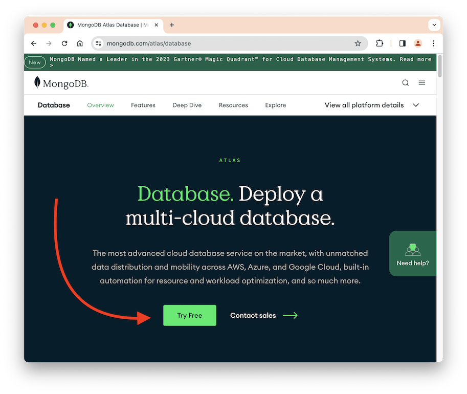

You'll be taken to the registration page, where you can create an account for free:

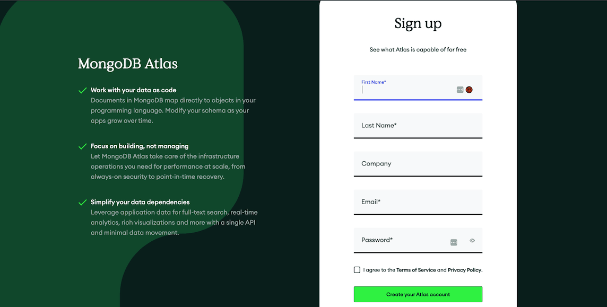

1. Fill in the required fields.

2. When you're done, click "Create your Atlas account".

3. Next, you will be sent an email verification. Verify your email by clicking the "Verify Email" button on that email as shown in the image below:

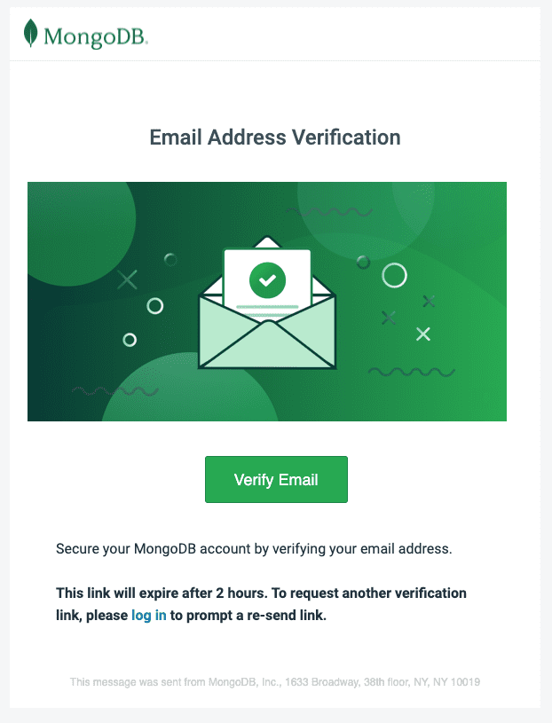

1. After verifying your email, head back to the [Login page](https://accounand login using your credentials.

## Welcome to Atlas

Upon logging in for the first time, you will be presented with a "Welcome to Atlas!" page.

1. For "What is your goal primary goal?", select "Learn MongoDB".

2. For "How long have you been developing software with MongoDB??", select "Less than a year".

3. Select "JavaScript / Node.js" as your primary language.

4. For "What kind(s) of data will your project use?" and "Will your application include any of the following architectural models?", you can select any answer. Select "Not sure/None" if you want to skip these.

Your form should look like the image below:

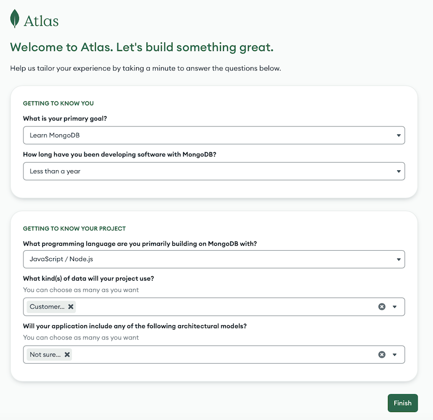

## Create a Cluster

Upon completing the form, you will be directed to the _Deploy your database_ page.

If you arrive at the Overview page instead, you can click the big green _+ Create_ button to go to the _Deploy your database_ page:

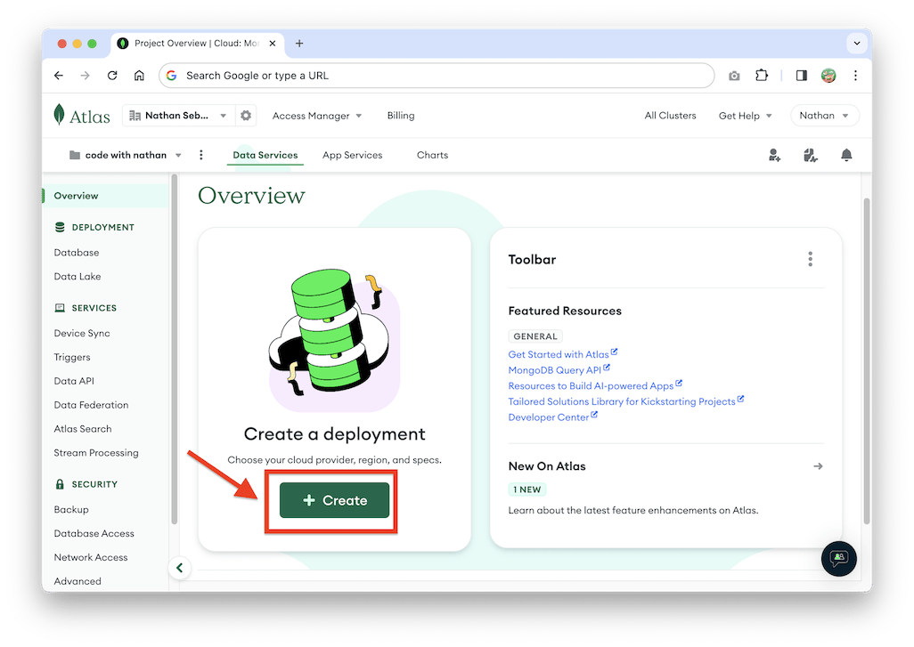

On the _Deploy your database_ page, Select the _M0 FREE_ plan, which is ideal for testing and development:

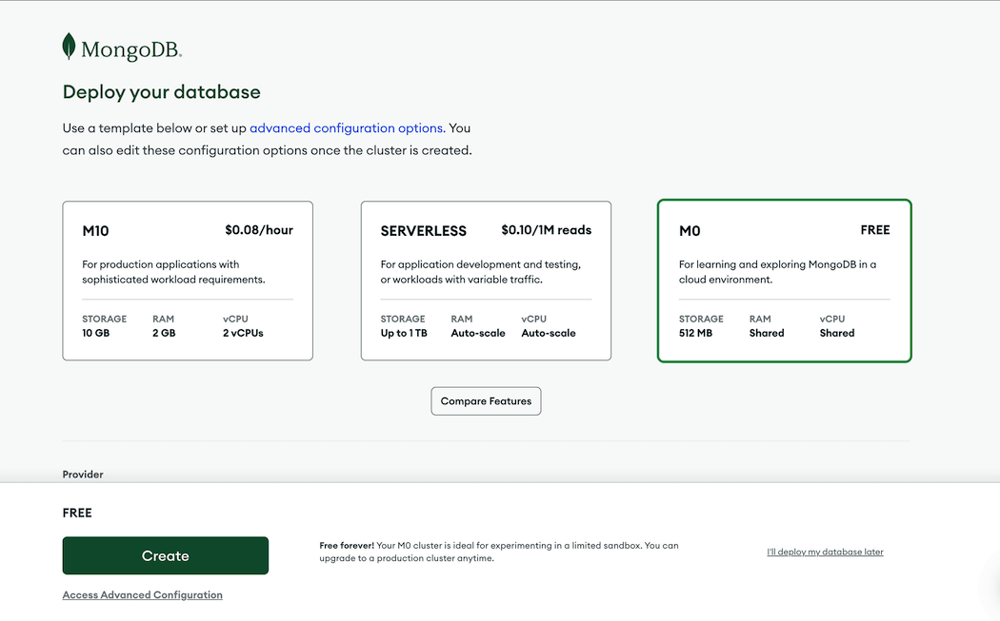

The _Provider_ option is the cloud service provider that will host your database. You're free to select whichever you like. 

AWS, Google Cloud, and Azure all offer the same free tier. For the region, select the region that's recommended or is closest to you. 

You can accept the default cluster name provided, usually 'Cluster0'. Leave the tag empty as it's optional. After selecting your provider and nearest region, you can click the green "Create" button:

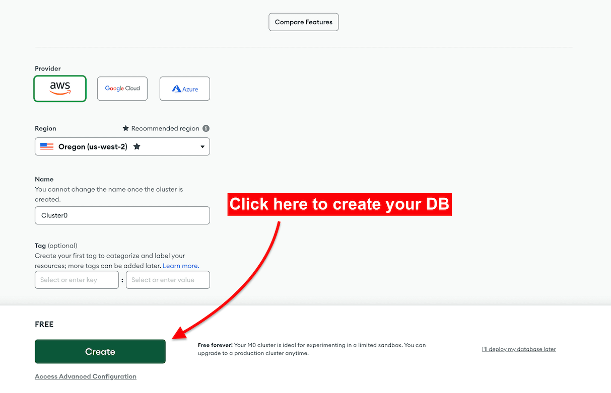

Now you need to wait a bit for the cluster to be created by MongoDB. If this is the first time you use MongoDB Atlas, you'll be taken directly to the _Security Quickstart_ page after the cluster is created. 

## Security Quickstart: Set Authentication and Connection

Here, you'll be asked two questions. First is how to authenticate connections to your database.

You can select Username and Password, then use the Username and Password that have been generated for you. Click _Create User_ as shown below:

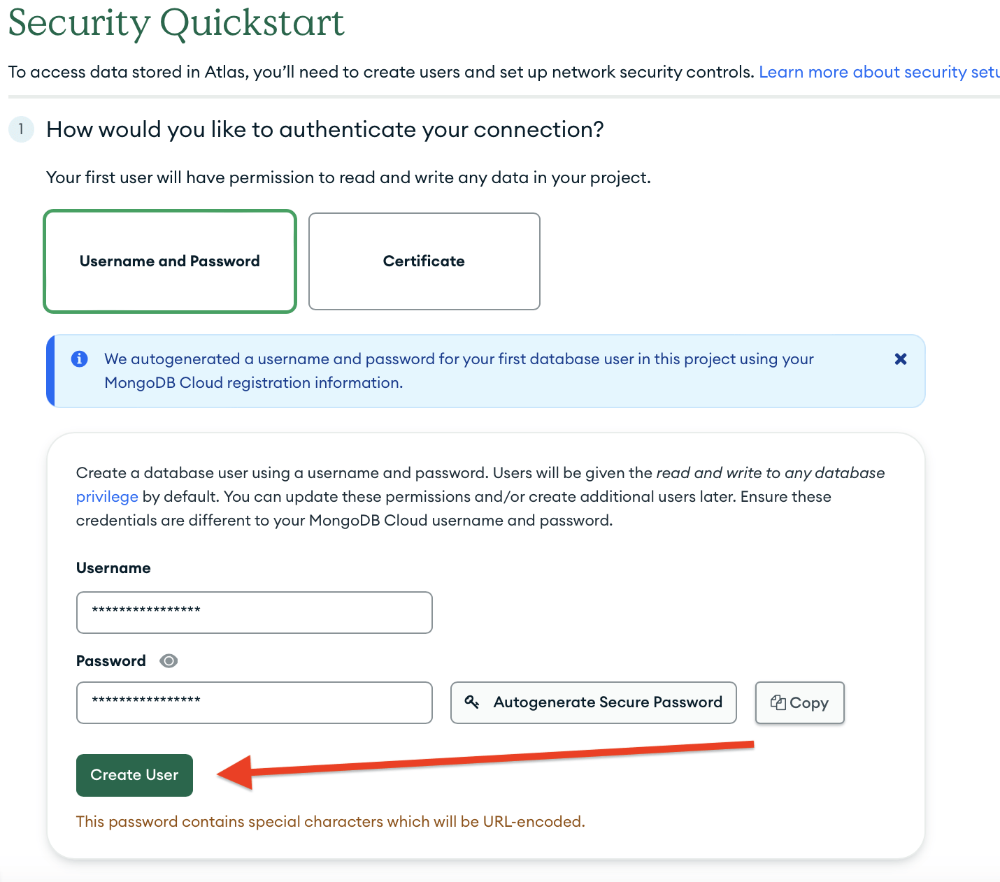

Next, you need to enable access to the database from specific IP addresses. Because this is a development database, you can enter '0.0.0.0' as the IP address value to enable access from anywhere:

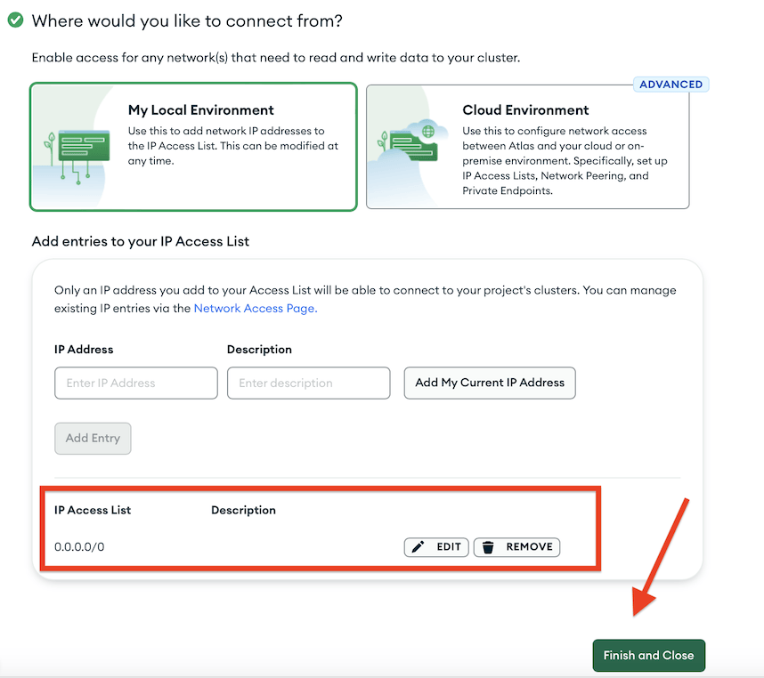

Now you can click _Finish and Close_. You should be redirected to the _Overview_ page, where your active cluster is shown:

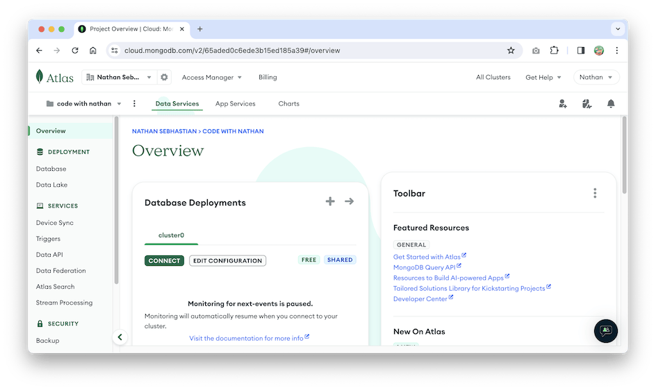

The cluster is ready to accept incoming connections. Great work!

## Add a New Database User

There may be times when you want to add another user or whitelist an IP address. Because the _Security Quickstart_ is gone after you create a cluster, you need to navigate the Atlas menu.

To add a new database user, follow these steps:

1. On the left-hand navigation menu, under Security, select the _Database Access_ link.

2. From there, click the _Add New Database User_ button just above the Users table. The following image shows the create user modal with the options you'll need to select:
   
.Adding a New User to Database
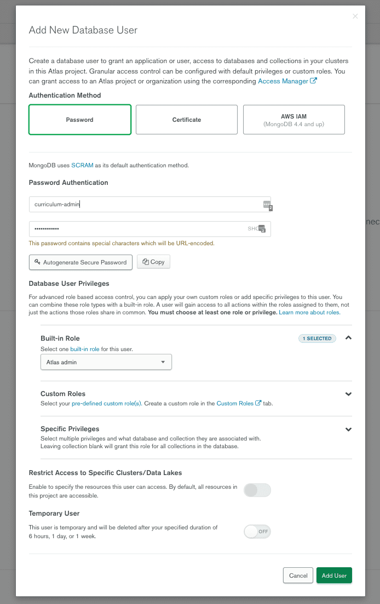

To fill out the form, follow these steps:

- For _Authentication Method_, choose _Password_.
- Under _Password Authentication_, create a Username and Password that you'll remember.
- Under _Database User Privileges_, select _Atlas admin_.
- Leave any remaining options as default.
- IMPORTANT: Do not enable _Temporary User_ unless you want to make a new user every so often.
- When you're done, click _Add User_.

## Allow Your IP Address

To allow a new IP address, you need to select the _Network Access_ menu from the _Security_ tab on the left side, then add the IP address you want. 

On the Network Access page, click the _Add IP Address_ green button and a modal will appear:

.Whitelisting an IP Address
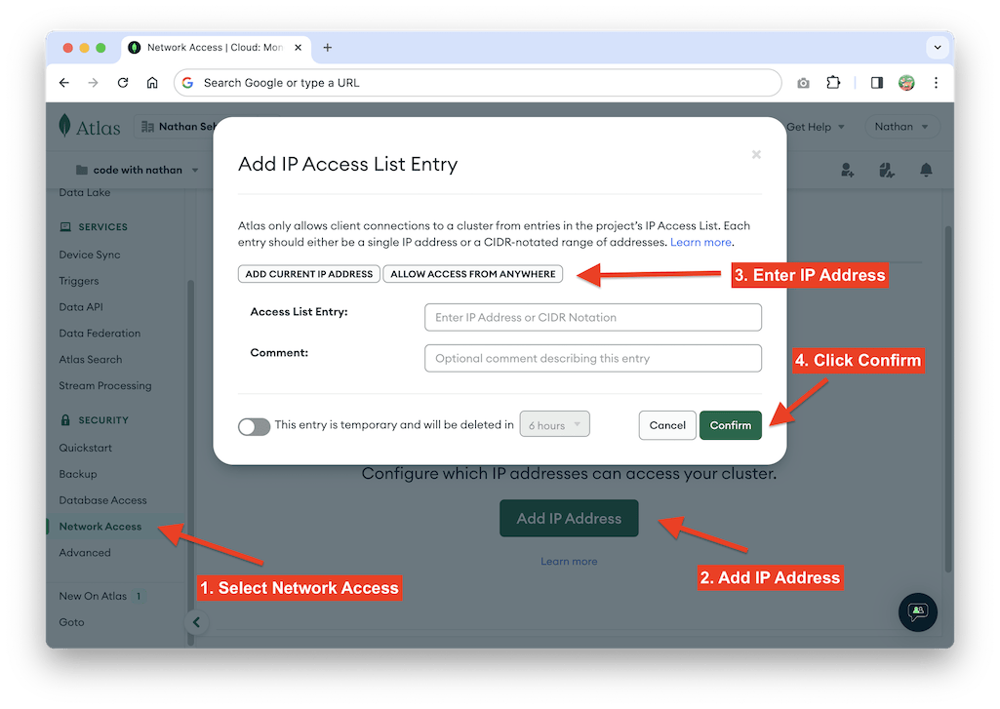

You can add your IP address in the modal shown above. You can also enable connection from anywhere by clicking the _Allow Access From Anywhere_ button, or just add your IP address with the _Add Current IP Address_ button.

Click _Confirm_ when you're done, and that's how you add a new user or IP address in MongoDB Atlas.

With your database cluster ready, you can start using MongoDB database in your application.
